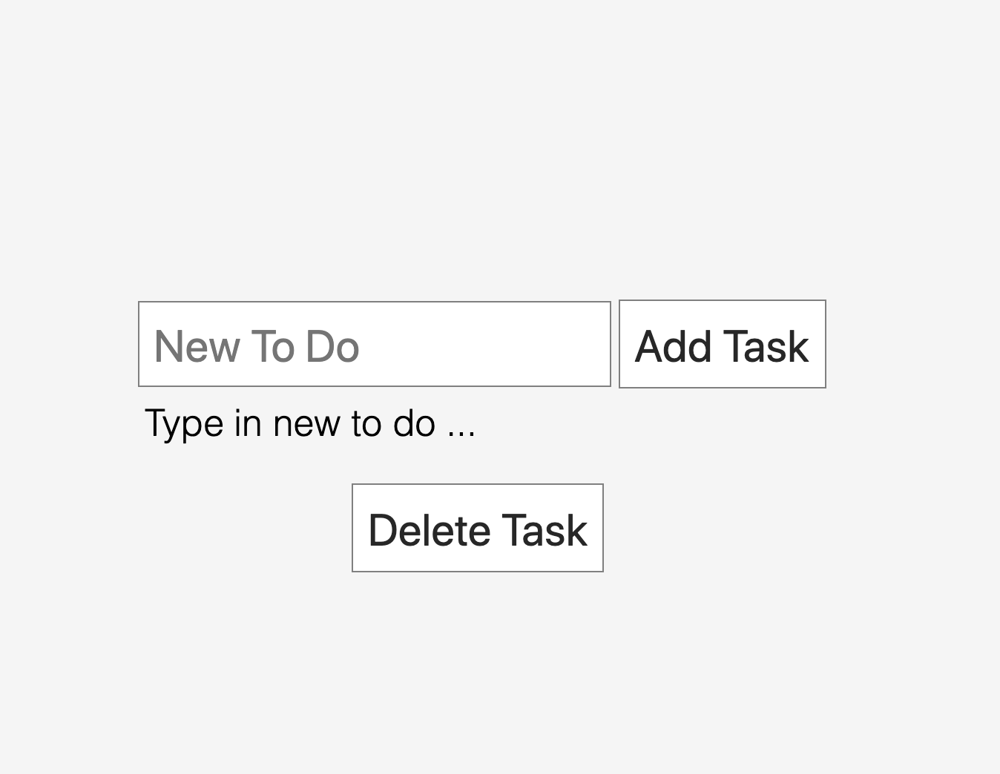

# Laravel Todo List

Laravel to do list app is a simple to do list app using laravel + jquery + ajax + docker.

## How to run

Make sure your machine has already installed docker. If you don't installed it you can follow this link [docker install](https://docs.docker.com/install/) and docker compse [docker compose install](https://docs.docker.com/compose/install/)

After that, you just only run this command:
```
docker-compose up -d
```
and for stoping service
```
docker-compose down
```
After that, you just only visit http://localhost:8088/ and viola, you will see this page



Congratulation... :tada:
